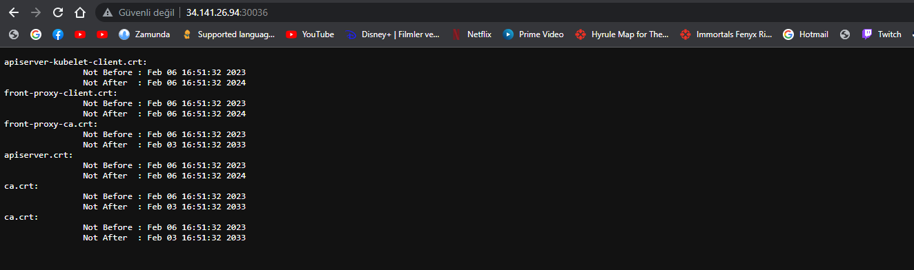
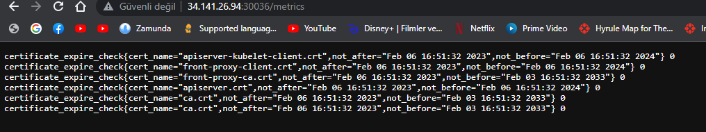
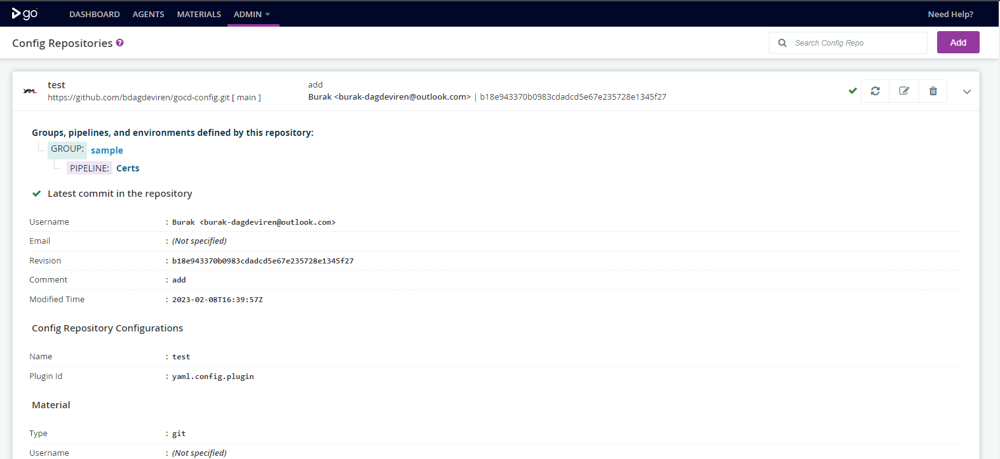

## Kubernetes and Monitoring Tool Installation (Debian)

1. Install util packages
```
    apt-get update && apt-get install apt-transport-https ca-certificates curl software-properties-common -y
```

2. Add containerd.io repository in debain and install
```
    curl -fsSL https://download.docker.com/linux/debian/gpg | apt-key add -
    echo \
        "deb [arch=$(dpkg --print-architecture)] https://download.docker.com/linux/debian \
        $(lsb_release -cs) stable" | sudo tee /etc/apt/sources.list.d/docker.list > /dev/null
    sudo apt-get update
    sudo apt-get install containerd.io
```
3. Change containerd.io cgroups types to systemd in config.toml file and restart containerd service
```
    [plugins."io.containerd.grpc.v1.cri".containerd.runtimes.runc.options]
       systemdCgroup = true
```
4. Need to update kubernetes packages source and install kubernetes packages
```
   curl -s https://packages.cloud.google.com/apt/doc/apt-key.gpg | apt-key add -
   cat <<EOF >/etc/apt/sources.list.d/kubernetes.list
   deb https://apt.kubernetes.io/ kubernetes-xenial main
   EOF
   apt-get update
   apt-get install -y kubelet kubeadm kubectl
   apt-mark hold kubelet kubeadm kubectl
```
5. Then need to disable swap
```
    sudo swapoff -a 
    sudo sed -i '/ swap / s/^\(.*\)$/#\1/g' /etc/fstab
```
6. Modify kernel parameters at runtime and add system module
```
    cat <<EOF | sudo tee /etc/modules-load.d/containerd.conf
    overlay
    br_netfilter
    EOF
    
    sudo modprobe br_netfilter
    sudo modprobe overlay
    
    cat <<EOF | sudo tee /etc/sysctl.d/99-kubernetes-k8s.conf
    net.bridge.bridge-nf-call-iptables = 1
    net.ipv4.ip_forward = 1
    net.bridge.bridge-nf-call-ip6tables = 1
    EOF
    
    sudo sysctl --system
```
7. Init kubernetes master node
```
    sudo kubeadm init --control-plane-endpoint={{ master_node_ip_address }}
    
    mkdir -p $HOME/.kube
    sudo cp -i /etc/kubernetes/admin.conf $HOME/.kube/config
    sudo chown $(id -u):$(id -g) $HOME/.kube/config
```

8. Next step connect worker node to master node
```
    Create join command on master node 
    kubeadm token create  --print-join-command
    Then run the output command on the master node
    
```

9. Install Calico Overlay Network
```
    kubectl apply -f yamls/calico/calico.yaml
```

10. Add prometheus helm chart repository and install it
```
    kubectl create ns monitoring
    helm repo add prometheus-community https://prometheus-community.github.io/helm-charts
    helm install prometheus prometheus-community/kube-prometheus-stack -n monitoring
```

11. Create AlertManagerRules on Prometheus like below
```
    apiVersion: monitoring.coreos.com/v1
    kind: PrometheusRule
    metadata:
      labels:
        prometheus: kube-stack-prometheus-kube-prometheus
        role: alert-rules
      name: system-rule
    spec:
      groups:
        - name: custom_rules
          rules:
            - record: node_memory_MemFree_percent
              expr: 100 - (100 * node_memory_MemFree_bytes / node_memory_MemTotal_bytes)
            - record: node_filesystem_free_percent
              expr: 100 * node_filesystem_free_bytes{mountpoint="/"} / node_filesystem_size_bytes{mountpoint="/"}
        - name: alert_rules
          rules:
            - alert: InstanceDown
              expr: up == 0
              for: 1m
              labels:
                severity: critical
              annotations:
                summary: "Instance [{{ $labels.instance }}] down"
                description: "[{{ $labels.instance }}] of job [{{ $labels.job }}] has been down for more than 1 minute."
            - alert: DiskSpaceFree10Percent
              expr: node_filesystem_free_percent <= 10
              labels:
                severity: warning
              annotations:
                summary: "Instance [{{ $labels.instance }}] has 10% or less Free disk space"
                description: "[{{ $labels.instance }}] has only {{ $value }}% or less free."
            - alert: CertificateExpiresLessThen1Month(CA)
              expr: certificate_expire_check{cert_name="ca.crt"} > 0
              labels:
                severity: critical
              annotations:
                summary: "less than 1 month until the certificate expires"
                description: "less than 1 month until the certificate expires"
```
12. Configuring Alertmanager to send us a mail when there is an alert. We will change this configuration from within kubernetes secret (Secret Name: alertmanager-kube-stack-prometheus-kube-alertmanager)
```
    global:
      resolve_timeout: 5m
    
    route:
      group_by: ['alertname']
      group_wait: 10s
      group_interval: 10s
      repeat_interval: 10s
      receiver: 'email'
    receivers:
    - name: 'email'
      email_configs:
      - to: 'receiver_mail_id@gmail.com'
        from: 'mail_id@gmail.com'
        smarthost: smtp.gmail.com:587
        auth_username: 'mail_id@gmail.com'
        auth_identity: 'mail_id@gmail.com'
        auth_password: 'password'
    inhibit_rules:
      - source_match:
          severity: 'critical'
        target_match:
          severity: 'warning'
        equal: ['alertname', 'dev', 'instance']
```

## Software Development

### Pre Requirements
```
Python 3.9.13
FastApi 0.90.0
Openssl 23.0.0
PyInstaller 5.7.0
Uvicorn 0.20.0
Staticx 0.13.8
```

Calculated certificate expiration time using openssl library in /etc/kubernetes/pki and serve with web server.





## CD Operations

1. Add gocd helm chart repository and install it
```
    helm repo add gocd https://gocd.github.io/helm-chart
    helm install gocd gocd/gocd --set server.service.type=NodePort --set server.service.nodeHttpPort=30001 --set server.persistence.enabled=false
```
2. Add config repositories from github




